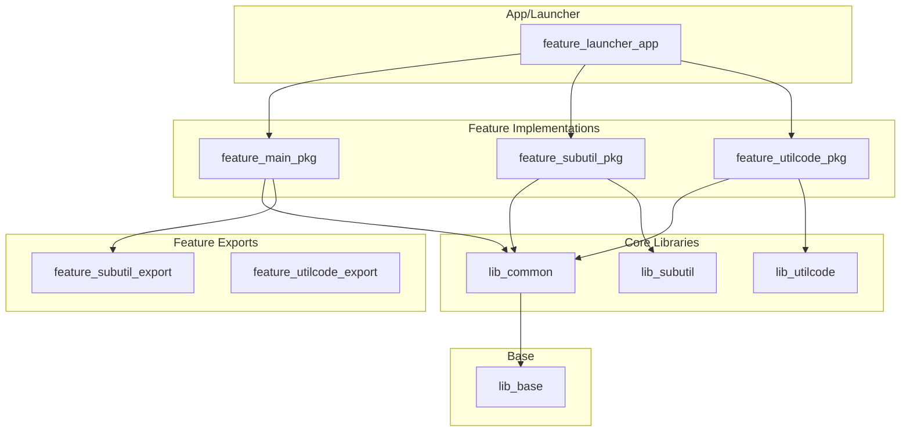

# AndroidUtilCode 项目架构分析

本文档旨在深入分析 AndroidUtilCode 项目的整体架构，包括其主要模块构成、数据流与依赖关系、采用的设计模式以及潜在的架构问题。

## 1. 主要模块和职责

该项目采用高度模块化的架构，按照职责主要可分为三类：**基础库 (lib)**、**功能模块 (feature)** 和 **Gradle 插件 (plugin)**。

### 1.1. 基础库 (lib)

`lib` 模块提供了整个应用的基础能力和通用组件。

- **`lib_base`**: 最基础的模块，提供通用的基类，如 `BaseActivity`, `BaseFragment` 等，是其他所有业务模块的基础。
- **`lib_common`**: 通用组件库，包含项目中共享的 UI 控件、工具类、资源文件等。它依赖于 `lib_base`。
- **`lib_utilcode`**: 项目的核心，即 `AndroidUtilCode` 工具库本身。它是一个功能完备、高度独立的库，负责提供各种系统 API 的封装和便捷工具。该模块可被独立编译和发布。
- **`lib_subutil`**: 另一个独立的工具库，提供了 `utilcode` 之外的补充工具。
- **`lib_utildebug` / `lib_utildebug_no_op`**: 调试功能模块。采用 `debugImplementation` 和 `releaseImplementation` 的方式，在 Debug 模式下引入功能齐全的调试工具，而在 Release 模式下则替换为一个空实现的 `no-op` 版本，巧妙地实现了调试代码的隔离，避免了将调试逻辑打包到正式版中。

### 1.2. 功能模块 (feature)

`feature` 模块体现了"功能化"和"组件化"的开发思想，每个主要功能都被拆分成独立的模块，并采用 `_app`, `_pkg`, `_export` 的三层结构。

- **`_app` (壳工程)**: 每一个 `_app` 模块都是一个可以独立运行的 Android Application。它的主要职责是在开发阶段作为一个"壳"或"容器"，用于单独调试其对应的功能模块，实现了功能的独立开发和测试。例如，`feature_main_app` 用来调试 `main` 功能。
- **`_pkg` (功能实现)**: 这是功能的具体实现，是一个 Android Library。项目中大部分的业务逻辑和界面都在这一层。
- **`_export` (接口暴露)**: 这是一个轻量级的 Android Library，只包含该功能对外暴露的 `interface` 和数据模型 (POJO)。它用于解耦模块间的直接依赖，避免循环依赖。

### 1.3. Gradle 插件 (plugin)

项目开发了多个自定义 Gradle 插件来自动化构建流程和实现特定的架构需求。

- **`plugin_buildSrc_plugin`, `plugin_api_gradle_plugin`, `plugin_bus_gradle_plugin`**: 这些是项目自定义的插件，用于处理依赖注入、模块配置、API 管理和事件总线等，是项目高度自动化构建的核心。

## 2. 数据流向和依赖关系

项目的依赖关系设计精巧，通过 `buildSrc` 和自定义插件实现了中心化的版本和依赖管理。

### 2.1. 依赖关系图（简化）

### 2.2. 依赖管理

- **单一真相来源**: `buildSrc/src/main/groovy/Config.groovy` 是整个项目的"Single Source of Truth"，集中定义了所有依赖库的版本号、模块路径和插件信息。
- **动态配置**: 根目录下的 `module_config.json` 文件是模块开关的总控制台，可以通过修改它来决定哪些模块参与编译，实现了模块的动态加载和卸载。这个 JSON 文件由 `module_config.gradle` 解析，并动态更新 `Config.groovy` 文件。
- **依赖流向**:
    1.  应用入口 `feature_launcher_app` 依赖所有 `_pkg` 功能实现模块。
    2.  `_pkg` 模块依赖 `lib` 基础库来获取通用能力。
    3.  当一个功能（如 `feature_main`）需要调用另一个功能（如 `feature_subutil`）的接口时，它会依赖该功能的 `_export` 模块（`feature_subutil_export`），而不是其 `_pkg` 实现模块。这有效地实现了模块间的解耦。

## 3. 设计模式的使用

该项目在架构层面和代码层面应用了多种设计模式。

- **组件化架构 (Modular Architecture)**: 项目整体基于组件化思想构建，将不同功能解耦到独立的模块中，有利于团队协作、加速编译和实现功能的复用与隔离。
- **API 与实现分离 (Separation of Interface and Implementation)**: `_export` 和 `_pkg` 的分离是该模式的典型应用，调用方只依赖于稳定的接口，而不用关心具体的实现，降低了模块间的耦合度。
- **策略模式 (Strategy Pattern)**: `lib_utildebug` 和 `lib_utildebug_no_op` 的使用，在不同构建类型（debug/release）下提供不同的实现，是策略模式在构建过程中的绝佳应用。
- **事件总线 (Event Bus)**: 从 `plugin_bus_gradle_plugin` 插件和 `eventbus` 库的依赖来看，项目使用事件总线模式来进行跨模块或跨组件的通信，进一步降低耦合。
- **依赖注入 (Dependency Injection)**: 虽然没有明确看到 Dagger/Hilt 等框架，但项目在构建层面通过 Gradle 脚本和 `Config.groovy` 将依赖关系"注入"到各个模块中，可以看作是一种宏观上的依赖注入。

## 4. 潜在的架构问题

该架构设计精良，但也存在一些潜在的挑战：

- **复杂度过高**: 构建系统高度自动化和定制化，虽然强大，但也带来了极高的复杂度。新成员需要花费大量时间来理解整个构建流程和各种配置文件的作用，学习曲线较为陡峭。
- **隐式依赖**: `_app` 模块自动依赖所有 `_pkg` 模块的机制，虽然方便了集成调试，但也模糊了模块间真实的依赖关系，可能会在不经意间引入不必要的依赖。
- **职责混淆**: `feature_subutil` 和 `lib_subutil` 同时存在，它们之间的关系和职责划分不够清晰，可能会导致开发人员的困惑，存在一定的冗余风险。需要明确两者定位，考虑是否可以合并。 